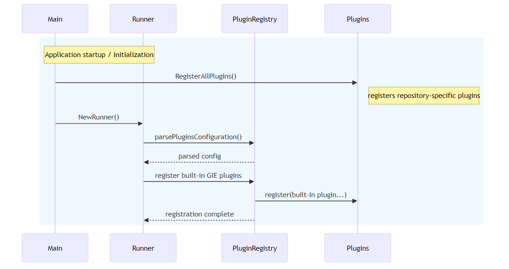
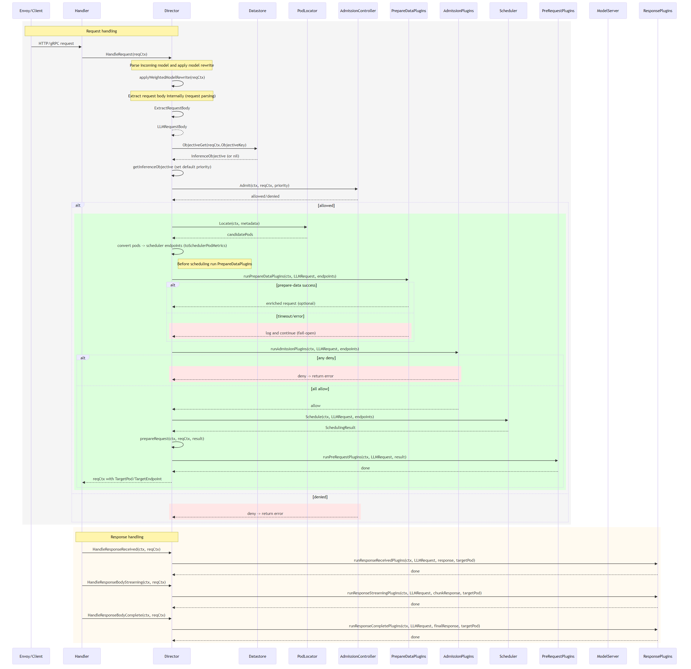
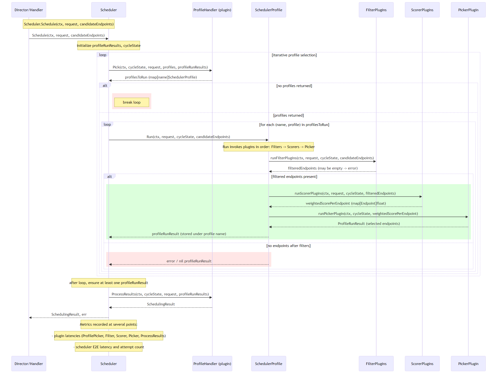
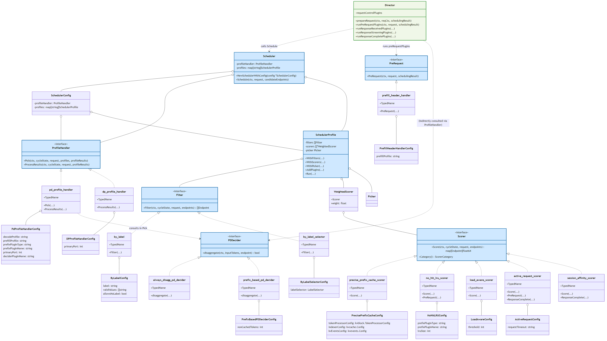

# LLM-D Architectural Views: Inference Scheduler

Last Update: 2026-03-08

This document contains select component-level (i.e. low-level) architectural views such as *UML sequence diagrams* and *UML class diagrams* pertaining to the [LLM-D Inference Scheduler](https://github.com/llm-d/llm-d-inference-scheduler/tree/main), which extends the [Gateway API Inference Extension](https://github.com/kubernetes-sigs/gateway-api-inference-extension/tree/main) a.k.a. GIE or IGW. The **Inference Scheduler** implements optimized request routing logic that leverages **dissagregated Prefill-Decode (PD)** inference cluster topologies.

For high-level architectural views, consult the repos that this document references, as well as this excellent video by Robert Shaw presenting a technical overview of LLM-D's features:

[](https://www.youtube.com/watch?v=_xAXb70d4-0)

## Executive summary
- **Purpose**: provide a concise, **developer-focused reference** tying configuration to runtime behavior so contributors can find where to implement new scheduling logic.
- **Scope**: explains extension points (`PrepareData`, `Filter`, `Scorer`, `ProfileHandler`, `PreRequest`), the scheduling lifecycle (Prepare → Filter → Score → Pick → PreRequest/Response), and common plugin implementations with direct links to source files.
- **Deliverables**: UML class/sequence diagrams, per-plugin examples and appendices, and configuration-to-runtime mapping to speed discovery and safe changes.
- **Use**: read this first to decide the correct extension point and then follow the linked factories and files to implement or register plugins.

## Limitations
- **Not exhaustive**: this document does not attempt to list every plugin, interface, or runtime behavior across the repository or upstream dependencies — omissions are expected.
- **Work in progress**: content, examples, and links may change; treat this as a living reference and open issues/PRs for corrections or additions.
- **Focus**: the document concentrates on the LLM-D Inference Scheduler and scheduler-related extension points; other components are referenced but not comprehensively documented here.

## Initialization sequence
Upon startin, the EPP performs the following intialization sequence: 
- `cmd/epp/main.go`: [cmd/epp/main.go](https://github.com/llm-d/llm-d-inference-scheduler/blob/main/cmd/epp/main.go) — calls `plugins.RegisterAllPlugins()` and starts the `Runner`.
- `pkg/plugins/register.go`: [pkg/plugins/register.go](https://github.com/llm-d/llm-d-inference-scheduler/blob/main/pkg/plugins/register.go) — repository plugin factory registrations.
- Runner / plugin configuration (dependency): [github: gateway-api-inference-extension/cmd/epp/runner](https://github.com/kubernetes-sigs/gateway-api-inference-extension/blob/master/cmd/epp/runner) — `parsePluginsConfiguration()` and built-in plugin registration.



## Director (per-request) sequence
At the heart of the EPP (which extends the Gateway API Inference Extension) is the Director, which is responsible for managing the lifecycle of incoming inference requests.  This section describes the key classifiers and shows theire collaboration via a UML sequence diagram:

- [Director](https://github.com/kubernetes-sigs/gateway-api-inference-extension/blob/master/pkg/epp/requestcontrol/director.go):  request orchestration and plugin invocation.

    - Orchestrates the entire per-request lifecycle: accepts `reqCtx`, fetches the [`InferenceObjective`](https://github.com/kubernetes-sigs/gateway-api-inference-extension/blob/master/apix/v1alpha2/inferenceobjective_types.go), and sets defaults (priority, timeouts) when none is present. The `InferenceObjective` is a lightweight policy object (target model/profile, priority, placement hints, and tags) usually supplied by the request originator, an API/adapter, or by operator configuration and persisted in the Datastore. Plugins consult the `InferenceObjective` to influence behavior.

    - Calls the admission controller (`Admit(...)`) to allow or deny requests early, preventing unnecessary work for denied requests.

    - Uses `contracts.PodLocator` to discover **candidate pods** and converts them into scheduler endpoints.

    - Runs [`PrepareDataPlugin`](https://github.com/kubernetes-sigs/gateway-api-inference-extension/blob/master/pkg/epp/framework/interface/requestcontrol/plugins.go) implementations to enrich or decorate the `LLMRequest` before scheduling based on `InferenceObjective` fields (preferred model, profile, or request-level hints); failures/timeouts are logged and treated fail-open. These plugins receive the `LLMRequest` and candidate endpoints, may mutate or attach metadata, and should avoid blocking indefinitely. Notable upstream/framework `PrepareDataPlugin` implementations referenced or used by the scheduler:
    - [`prefix`](https://github.com/kubernetes-sigs/gateway-api-inference-extension/blob/master/pkg/epp/framework/plugins/scheduling/scorer/prefix/plugin.go) prepare plugin (hashes the prompt and attaches longest-prefix match info to endpoints; see Appendix G)
    - [`predicted-latency`](https://github.com/kubernetes-sigs/gateway-api-inference-extension/blob/master/pkg/epp/framework/plugins/scheduling/scorer/predictedlatency/) prepare hooks (prepares SLO context and predictions used by latency-aware scoring; see Appendix H)

    - Runs [`AdmissionPlugin`](https://github.com/kubernetes-sigs/gateway-api-inference-extension/blob/master/pkg/epp/framework/interface/requestcontrol/plugins.go) evaluates `InferenceObjective` constraints (priority, tenancy, policy) and can allow/deny a request (return `nil` to allow, non-nil `error` to deny). Admission plugins evaluate the `LLMRequest` and endpoints and return allow/deny with optional reasons.

    - Runs the `Scheduler`, which runs the concrete `Filter` + `Scorer` pipeline to apply objective preferences when ranking or excluding endpoints (e.g., prefer specific profiles or locality). The `Filter` and `Scorer` interfaces are declared [here](https://github.com/kubernetes-sigs/gateway-api-inference-extension/blob/master/pkg/epp/framework/interface/scheduling/plugins.go); examples live in [pkg/plugins/filter](https://github.com/llm-d/llm-d-inference-scheduler/blob/main/pkg/plugins/filter) and [pkg/plugins/scorer](https://github.com/llm-d/llm-d-inference-scheduler/blob/main/pkg/plugins/scorer). See the `Scheduler` ([interface](https://github.com/kubernetes-sigs/gateway-api-inference-extension/blob/master/pkg/epp/requestcontrol/director.go)) and its [concrete implementation](https://github.com/kubernetes-sigs/gateway-api-inference-extension/blob/master/pkg/epp/scheduling/scheduler.go).
        - [pkg/plugins/filter/by_label.go](https://github.com/llm-d/llm-d-inference-scheduler/blob/main/pkg/plugins/filter/by_label.go): a `Filter` that selects endpoints by a single label key and a whitelist of allowed values. See Appendix A.
        - [pkg/plugins/filter/by_label_selector.go](https://github.com/llm-d/llm-d-inference-scheduler/blob/main/pkg/plugins/filter/by_label_selector.go): a `Filter` that applies a Kubernetes-style label selector against endpoint `Metadata.Labels`. See Appendix B.
        - [pkg/plugins/filter/pd_role.go](https://github.com/llm-d/llm-d-inference-scheduler/blob/main/pkg/plugins/filter/pd_role.go): PD‑role `Filter` for disaggregated Prefill‑Decode (PD) inference clusters. See Appendix C.
        - [pkg/plugins/scorer/load_aware.go](https://github.com/llm-d/llm-d-inference-scheduler/blob/main/pkg/plugins/scorer/load_aware.go): a `Scorer` that scores endpoints inversely proportional to current observed load. See Appendix D.
        - [pkg/plugins/scorer/no_hit_lru.go](https://github.com/llm-d/llm-d-inference-scheduler/blob/main/pkg/plugins/scorer/no_hit_lru.go): a `Scorer` implementing a no-hit LRU strategy to prefer warm endpoints and reduce cold starts. See Appendix E.
        - [pkg/plugins/scorer/precise_prefix_cache.go](https://github.com/llm-d/llm-d-inference-scheduler/blob/main/pkg/plugins/scorer/precise_prefix_cache.go): prefix-cache aware `Scorer` that rewards endpoints with matching cached prefixes. See Appendix F.

    - Runs the Scheduler to pick a `TargetPod`/endpoint and returns a [`SchedulingResult`](https://github.com/kubernetes-sigs/gateway-api-inference-extension/blob/master/pkg/epp/framework/interface/scheduling/types.go) used to prepare the outgoing request.

    - Executes [`PreRequest`](https://github.com/kubernetes-sigs/gateway-api-inference-extension/blob/master/pkg/epp/framework/interface/requestcontrol/plugins.go) plugins to finalize headers, routing, or authentication and then returns a populated `reqCtx` to the handler.
      - [pkg/plugins/pre-request/pd_prerequest.go](https://github.com/llm-d/llm-d-inference-scheduler/blob/main/pkg/plugins/pre-request/pd_prerequest.go): prepares the outbound request to the model server (target selection, header injection, auth headers).
      - [pkg/plugins/scorer/active_request.go](https://github.com/llm-d/llm-d-inference-scheduler/blob/main/pkg/plugins/scorer/active_request.go): `ActiveRequest` plugin that annotates/records active-request state before dispatch.
      - [pkg/plugins/scorer/no_hit_lru.go](https://github.com/llm-d/llm-d-inference-scheduler/blob/main/pkg/plugins/scorer/no_hit_lru.go): `NoHitLRU` PreRequest that restores/updates cold-start state and related metrics before sending requests.

    - On response paths, invokes response plugins for received, streaming, and complete events (for logging, metrics, or post-processing). Response plugins handle response events (received, streaming chunks, completion) and can transform, log, or emit metrics.

    - Exposes helper utilities used across flows (model rewrites, weighted model selection, metric conversion, random endpoint selection).

 

- Scheduling types (dependency): [https://github.com/kubernetes-sigs/gateway-api-inference-extension/blob/master/pkg/epp/framework/interface/scheduling/types.go](https://github.com/kubernetes-sigs/gateway-api-inference-extension/blob/master/pkg/epp/framework/interface/scheduling/types.go) — `LLMRequest`.
    - `LLMRequest`: canonical request model carrying payload, model id, metadata, priority, and timeouts passed to plugins and scheduler.
    - `SchedulingResult`: encapsulates the chosen pod/endpoint, scoring details, rewrites, and routing hints the Director uses to prepare the outbound request.

- Pod locator / Scheduler: `contracts.PodLocator` (see Director) and scheduler implementations under [pkg/scheduling/pd](pkg/scheduling/pd).
    - `contracts.PodLocator`: abstract discovery API used to list candidate pods matching request metadata (model, labels, locality).
    - Scheduler implementations convert discovered pods to endpoints, apply filters and scorers, and run selection algorithms.
    - The scheduling pipeline uses filter and scorer plugins (and may apply weighted-model selection or rewrite rules) to return the best endpoint(s).

- Prepare/PreRequest/Admission/Response plugin implementations in this repo: [pkg/plugins/pre-request/pd_prerequest.go](https://github.com/llm-d/llm-d-inference-scheduler/blob/main/pkg/plugins/pre-request/pd_prerequest.go), scorer plugins under [pkg/plugins/scorer](https://github.com/llm-d/llm-d-inference-scheduler/blob/main/pkg/plugins/scorer), filter plugins under [pkg/plugins/filter], and profile/PD deciders under [pkg/plugins/profile].
    - `pkg/plugins/pre-request/pd_prerequest.go`: prepares the outbound request to the model server (target selection, header injection, auth headers).
    - `Scorer` (interface) plugins (`pkg/plugins/scorer`): compute numeric scores used by the scheduler to rank endpoints. Declaration: [https://github.com/kubernetes-sigs/gateway-api-inference-extension/blob/master/pkg/epp/framework/interface/scheduling/plugins.go](https://github.com/kubernetes-sigs/gateway-api-inference-extension/blob/master/pkg/epp/framework/interface/scheduling/plugins.go) — method: `Score(ctx, cycleState, request, pods) map[Endpoint]float64` (scores normalized to [0,1]) and `Category() ScorerCategory`.
    - `Filter` (interface) plugins (`pkg/plugins/filter`): exclude or mutate candidate endpoints before scoring. Declaration: [https://github.com/kubernetes-sigs/gateway-api-inference-extension/blob/master/pkg/epp/framework/interface/scheduling/plugins.go](https://github.com/kubernetes-sigs/gateway-api-inference-extension/blob/master/pkg/epp/framework/interface/scheduling/plugins.go) — method: `Filter(ctx, cycleState, request, pods) []Endpoint`.
    - Profile / PD deciders (`pkg/plugins/profile`): influence placement decisions (PD selection, fallback pools, priority-specific rules).
    - All repo plugins are registered via `pkg/plugins/register.go` and configured by the Runner; they must follow the defined interfaces and error-handling semantics.




## Scheduler sequence

- The [`Scheduler`](https://github.com/kubernetes-sigs/gateway-api-inference-extension/blob/master/pkg/epp/scheduling/scheduler.go) is responsible for converting candidate endpoints into a ranked/filtered selection suitable for routing. It is driven by two concepts:

- **SchedulerProfile** (see Appendix I): a per-profile configuration that lists:
  - zero or more `Filter` plugins
  - zero or more weighted `Scorer` plugins
  - and a single `Picker` plugin. 
  
    A profile encapsulates a routing strategy (for example: `decode` vs `prefill`, or `shadowing` vs `production`). See [https://github.com/kubernetes-sigs/gateway-api-inference-extension/blob/master/pkg/epp/scheduling/scheduler_profile.go](https://github.com/kubernetes-sigs/gateway-api-inference-extension/blob/master/pkg/epp/scheduling/scheduler_profile.go).

- **ProfileHandler**: a single plugin instance per `Scheduler` that decides, for each scheduling cycle, which profiles should run (the `Pick` extension point) and how to consolidate their results into a final `SchedulingResult` (the `ProcessResults` extension point). Examples and implementations live under `pkg/plugins/profile` (notably the PD-aware handler `pd_profile_handler.go`).

Key behaviors (from the code):
- The `Scheduler.Schedule(...)` loop repeatedly calls the configured `ProfileHandler.Pick(...)` to obtain a set of `SchedulerProfile` objects to run for this cycle. The loop continues until `Pick` returns an empty map.
- For each selected profile the Scheduler calls `profile.Run(...)`. `Run` executes the profile's plugins in strict order: `Filters` -> `Scorers` -> `Picker`. If filters remove all endpoints the profile run returns an error.
- `Filter` plugins prune or mutate candidate endpoints before scoring. If all endpoints are removed the profile run fails and its result is recorded as `nil` (the ProfileHandler sees this in `profileResults`).
- `Scorer` plugins return per-endpoint scores (normalized to [0,1]). The profile accumulates weighted scores across scorers using `WeightedScorer` weight values.
- The `Picker` plugin selects the final endpoint(s) (one or more) from the scored candidates.
- After all selected profiles have run, the Scheduler calls `ProfileHandler.ProcessResults(...)` to aggregate profile outputs and pick the `PrimaryProfileName` (which determines the default target endpoint used by the Director).
- The scheduler records plugin latencies and an overall scheduler E2E latency metric.

PD (Disaggregated Prefill‑Decode) notes:
- The PD-aware `PdProfileHandler` drives decode-first logic: it instructs the Scheduler to always run a `decode` profile first (so decode endpoints are located/scored), then decides whether to run a `prefill` profile based on a `pdDecider` plugin and the decode run results (see `pkg/plugins/profile/pd_profile_handler.go`).
- `ProcessResults` in the PD handler will transform decode results into a Data‑Parallel form when `primaryPort` is configured (it rewrites endpoint metadata ports and populates a header with the decode pod for subsequent PreRequest handling). When `prefill` also ran, `ProcessResults` includes both profile results in the returned `SchedulingResult`.




## Class diagram and configuration model
The following classifiers appear in the class diagram below.  They are most relevant to the Inference Scheduler.  This may not be a complete list.

### [Director](https://github.com/kubernetes-sigs/gateway-api-inference-extension/blob/master/pkg/epp/requestcontrol/director.go)
- **Key responsibilities**:
  - Calls `Scheduler.Schedule(...)` to get a `SchedulingResult` for a request.
  - Runs configured `PreRequest` plugins via `prepareRequest(...)` to mutate the outbound request (headers, endpoint rewrites) or update runtime state based on the `SchedulingResult`.
  - Runs response-stage plugins (`ResponseReceived`, `ResponseStreaming`, `ResponseComplete`) during response handling.
- **Key methods**:
  - [`prepareRequest(ctx context.Context, reqCtx *handlers.RequestContext, result *fwksched.SchedulingResult) (*handlers.RequestContext, error)`](https://github.com/kubernetes-sigs/gateway-api-inference-extension/blob/master/pkg/epp/requestcontrol/director.go#L246)
  - [`runPreRequestPlugins(ctx, request *fwksched.LLMRequest, schedulingResult *fwksched.SchedulingResult)`](https://github.com/kubernetes-sigs/gateway-api-inference-extension/blob/master/pkg/epp/requestcontrol/director.go#L296)
  - [`runResponseReceivedPlugins(...)`, `runResponseStreamingPlugins(...)`, `runResponseCompletePlugins(...)`](https://github.com/kubernetes-sigs/gateway-api-inference-extension/blob/master/pkg/epp/requestcontrol/director.go#L328)
- **Relationships**:
  - Calls the `Scheduler` to compute a `SchedulingResult`.
  - Invokes `PreRequest` plugins (e.g., `prefill-header-handler`) with the `SchedulingResult` to allow request mutation or side-effects.
  - Provides the `SchedulingResult` consumed by scorer `PreRequest` hooks (e.g., `no-hit-lru`, `active-request-scorer`) and by other request-control plugins.
- **Notes**: `Director` is the central coordinator for request-level plugin execution; it is not a plugin itself but runs plugins registered at the request-control extension points.

### [Scheduler](https://github.com/kubernetes-sigs/gateway-api-inference-extension/blob/master/pkg/epp/scheduling/scheduler.go)
- **Fields**:
  - `profileHandler` (`ProfileHandler`): configured `ProfileHandler` instance used to pick and process profiles
  - `profiles` (map[string]SchedulerProfile): map of named `SchedulerProfile` instances available to the scheduler
- **Key methods**:
  - [`NewSchedulerWithConfig(config *SchedulerConfig) *Scheduler`](https://github.com/kubernetes-sigs/gateway-api-inference-extension/blob/master/pkg/epp/scheduling/scheduler.go#L40)
  - [`Schedule(ctx context.Context, request *fwksched.LLMRequest, candidateEndpoints []fwksched.Endpoint) (*fwksched.SchedulingResult, error)`](https://github.com/kubernetes-sigs/gateway-api-inference-extension/blob/master/pkg/epp/scheduling/scheduler.go#L56)
- **Config object**: [`SchedulerConfig`](https://github.com/kubernetes-sigs/gateway-api-inference-extension/blob/master/pkg/epp/scheduling/scheduler_config.go).
- **Behavior / Notes**: `Scheduler` orchestrates iterative profile selection using the configured `ProfileHandler` (`Pick` → run `SchedulerProfile.Run` → repeat) and finally calls `ProfileHandler.ProcessResults` to aggregate and return a `SchedulingResult`. `Scheduler` itself is constructed programmatically and not driven directly from JSON plugin parameters.

#### [SchedulerProfile](https://github.com/kubernetes-sigs/gateway-api-inference-extension/blob/master/pkg/epp/scheduling/scheduler_profile.go#L44)
- **Fields**:
  - `filters []Filter` : ordered list of `Filter` plugins
  - `scorers []*WeightedScorer` : weighted scorers used for scoring
  - `picker Picker` : picker plugin used to choose final endpoints
- **Methods / Programmatic API**:
  - [`WithFilters(filters ...fwksched.Filter) *SchedulerProfile`](https://github.com/kubernetes-sigs/gateway-api-inference-extension/blob/master/pkg/epp/scheduling/scheduler_profile.go#L52)
  - [`WithScorers(scorers ...*WeightedScorer) *SchedulerProfile`](https://github.com/kubernetes-sigs/gateway-api-inference-extension/blob/master/pkg/epp/scheduling/scheduler_profile.go#L59)
  - [`WithPicker(picker fwksched.Picker) *SchedulerProfile`](https://github.com/kubernetes-sigs/gateway-api-inference-extension/blob/master/pkg/epp/scheduling/scheduler_profile.go#L66)
  - [`AddPlugins(pluginObjects ...plugin.Plugin) error`](https://github.com/kubernetes-sigs/gateway-api-inference-extension/blob/master/pkg/epp/scheduling/scheduler_profile.go#L76)
  - [`Run(ctx context.Context, request *fwksched.LLMRequest, cycleState *fwksched.CycleState, candidateEndpoints []fwksched.Endpoint) (*fwksched.ProfileRunResult, error)`](https://github.com/kubernetes-sigs/gateway-api-inference-extension/blob/master/pkg/epp/scheduling/scheduler_profile.go#L117)
- **Config**: none — `SchedulerProfile` is constructed programmatically via its API (`With*` / `AddPlugins`) rather than via JSON/rawParameters.  It is not considered part of the configuration model.  It appears in the UML class diagram to clarify its relationships to other classes related to plugins.

### Interfaces (lifecycle order)
The interfaces in this section are realized by plugins, most of which are configurable via YAML.

#### [ProfileHandler](https://github.com/kubernetes-sigs/gateway-api-inference-extension/blob/master/pkg/epp/framework/interface/scheduling/plugins.go)
- **Key responsibilities**:
  - Orchestrates which scheduling profiles to execute and aggregates results.
- **Key methods**:
  - `Pick(ctx context.Context, cycleState *scheduling.CycleState, request *scheduling.LLMRequest, profiles map[string]scheduling.SchedulerProfile, profileResults map[string]*scheduling.ProfileRunResult) map[string]scheduling.SchedulerProfile`
  - `ProcessResults(ctx context.Context, cycleState *scheduling.CycleState, request *scheduling.LLMRequest, profileResults map[string]*scheduling.ProfileRunResult) (*scheduling.SchedulingResult, error)`

#### [PD Decider (`pdDeciderPlugin`)](https://github.com/llm-d/llm-d-inference-scheduler/blob/main/pkg/plugins/profile/pd_profile_handler.go)
- **Key responsibilities**:
  - Consulted by `ProfileHandler.Pick` to decide whether prefill/disaggregated PD should run.
- **Key methods**:
  - `disaggregate(ctx context.Context, inputTokens int, endpoint scheduling.Endpoint) bool`

#### [Filter](https://github.com/kubernetes-sigs/gateway-api-inference-extension/blob/master/pkg/epp/framework/interface/scheduling/plugins.go)
- **Key responsibilities**:
  - Filters candidate endpoints during profile execution before scoring.
- **Key methods**:
  - `Filter(ctx context.Context, cycleState *scheduling.CycleState, request *scheduling.LLMRequest, endpoints []scheduling.Endpoint) []scheduling.Endpoint`

#### [Scorer](https://github.com/kubernetes-sigs/gateway-api-inference-extension/blob/master/pkg/epp/framework/interface/scheduling/plugins.go)
- **Key responsibilities**:
  - Assigns normalized scores (0..1) to endpoints during profile execution.
- **Key methods**:
  - `Score(ctx context.Context, cycleState *scheduling.CycleState, request *scheduling.LLMRequest, endpoints []scheduling.Endpoint) map[scheduling.Endpoint]float64`
  - `Category() scheduling.ScorerCategory`

#### [PreRequest](https://github.com/kubernetes-sigs/gateway-api-inference-extension/blob/master/pkg/epp/framework/interface/requestcontrol/plugins.go)
- **Key responsibilities**:
  - Hooks run after scheduling decisions and before outbound requests are sent; used to inject headers or routing info.
- **Key methods**:
  - `PreRequest(ctx context.Context, request *scheduling.LLMRequest, schedulingResult *scheduling.SchedulingResult)`


### Concrete Types (implemented by the LLM-D Inference Scheduler)

#### Concrete `ProfileHandler`s
- [**`pd-profile-handler`**](https://github.com/llm-d/llm-d-inference-scheduler/blob/main/pkg/plugins/profile/pd_profile_handler.go):
  - **Config**:
    - `decodeProfile` (string, default `decode`)
    - `prefillProfile` (string, default `prefill`)
    - `prefixPluginType` (string, default prefix cache plugin type)
    - `prefixPluginName` (string): instance name (defaults to `prefixPluginType`)
    - `primaryPort` (int): port for Data‑Parallel rewriting
    - `deciderPluginName` (string): typed name of PD decider plugin
  - **Behavior**:
    - enforces decode-first execution
    - uses configured `decider` plugin's `disaggregate(...)` result to decide whether to run prefill profile
    - stores `prefixPluginTypedName` (type+name) for other plugins to read prefix prepare-state from scheduling `CycleState`
    - rewrites endpoints / sets DataParallel header when `primaryPort` is set

- [**`data-parallel-profile-handler`**](https://github.com/llm-d/llm-d-inference-scheduler/blob/main/pkg/plugins/profile/dp_profile_handler.go):
  - **Config**:
    - `primaryPort` (int): port to set on returned endpoints (defaults to 8000)
  - **Behavior**:
    - expects a single profile
    - rewrites selected endpoints to use `primaryPort`
    - sets DataParallel header

#### Concrete PD Deciders (`pdDeciderPlugin`s)
- [**`always-disagg-pd-decider`**](https://github.com/llm-d/llm-d-inference-scheduler/blob/main/pkg/plugins/profile/always_disagg_decider.go):
  - **Config**:
    - none
  - **Behavior**:
    - `disaggregate(...)` always returns true

- [**`prefix-based-pd-decider`**](https://github.com/llm-d/llm-d-inference-scheduler/blob/main/pkg/plugins/profile/prefix_based_pd_decider.go):
  - **Config**:
    - `nonCachedTokens` (int): threshold of non-cached tokens that triggers disaggregation (must be >= 0)
  - **Behavior**:
    - reads prefix cache match info from endpoint (consumes `approximateprefix.PrefixCacheMatchInfoKey` — written by the [`prefix`](https://github.com/kubernetes-sigs/gateway-api-inference-extension/blob/master/pkg/epp/framework/plugins/scheduling/scorer/prefix/plugin.go) PrepareData plugin and stored in the scheduling `CycleState` under the plugin's `TypedName.String()` key)
    - decides based on computed non-cached suffix length

#### Concrete `Filter`s
- [**`by-label`**](https://github.com/llm-d/llm-d-inference-scheduler/blob/main/pkg/plugins/filter/by_label.go):
  - **Config**:
    - `label` (string): label key to check
    - `validValues` ([]string): allowed values
    - `allowsNoLabel` (bool): treat missing label as allowed
  - **Behavior**: returns endpoints whose `Metadata.Labels[label]` is present in `validValues`; when `allowsNoLabel=true` endpoints missing the label are also included.
    
- [**`by-label-selector`**](https://github.com/llm-d/llm-d-inference-scheduler/blob/main/pkg/plugins/filter/by_label_selector.go):
  - **Config**:
    - Kubernetes `LabelSelector` (structured): selects endpoints matching the selector
  - **Behavior**: retains only endpoints whose `Metadata.Labels` satisfy the configured selector; if the selector matches no endpoints the candidate set will be empty.

#### Concrete `Scorer`s
- [**`precise-prefix-cache-scorer`**](https://github.com/llm-d/llm-d-inference-scheduler/blob/main/pkg/plugins/scorer/precise_prefix_cache.go):
  - **Config**:
    - `tokenProcessorConfig` (`kvblock.TokenProcessorConfig`): tokenization settings
    - `indexerConfig` (`kvcache.Config`): indexer and tokenizer pool config (requires modelName)
    - `kvEventsConfig` (`kvevents.Config`): event subscription and discovery settings
  - **Behavior**: computes per-endpoint locality scores using KV-cache indexer; writes prefix prepare-state into cycle state (keyed by plugin typed-name).

- [**`no-hit-lru-scorer`**](https://github.com/llm-d/llm-d-inference-scheduler/blob/main/pkg/plugins/scorer/no_hit_lru.go):
  - **Config**:
    - `prefixPluginType` (string): typed-name of prefix plugin to read state from
    - `prefixPluginName` (string): instance name (defaults to typed name)
    - `lruSize` (int): LRU capacity (default 1024)
  - **Behavior**: reads prefix prepare-state (by typed-name) to detect cold requests; for cold requests ranks endpoints by LRU of prior cold-targets; implements `PreRequest` to update LRU on cold requests.

- [**`load-aware-scorer`**](https://github.com/llm-d/llm-d-inference-scheduler/blob/main/pkg/plugins/scorer/load_aware.go):
  - **Config**:
    - `threshold` (int): queue threshold (default 128)
  - **Behavior**: penalizes endpoints with high waiting queue sizes; scores in [0,1] relative to threshold.

- [**`active-request-scorer`**](https://github.com/llm-d/llm-d-inference-scheduler/blob/main/pkg/plugins/scorer/active_request.go):
  - **Config**:
    - `requestTimeout` (string): TTL for in-flight request tracking (duration string, default 2m)
  - **Behavior**: tracks active requests per endpoint; scores endpoints inversely to active counts; implements `PreRequest` and `ResponseComplete` to maintain counts.

- [**`session-affinity-scorer`**](https://github.com/llm-d/llm-d-inference-scheduler/blob/main/pkg/plugins/scorer/session_affinity.go):
  - **Config**: none.
  - **Behavior**: routes requests within a session to the same pod using a session token header; implements `ResponseComplete` to set session token header.

#### [WeightedScorer](https://github.com/kubernetes-sigs/gateway-api-inference-extension/blob/master/pkg/epp/scheduling/weighted_scorer.go#L24)
- **Fields**:
  - embeds `fwksched.Scorer` (the wrapped scorer implementation)
  - `weight` (float64): relative weight used when aggregating scorer outputs
- **Behavior / Notes**: `WeightedScorer` is a runtime wrapper (not a standalone plugin) used by `SchedulerProfile` to apply weights to scorer outputs. Create via `NewWeightedScorer(scorer, weight)`. The config loader may wrap configured scorer instances with `NewWeightedScorer` when a weight is present in serialized profile configuration.

#### Concrete `PreRequest` Plugins
- **`prefill-header-handler`**: [pkg/plugins/pre-request/pd_prerequest.go](https://github.com/llm-d/llm-d-inference-scheduler/blob/main/pkg/plugins/pre-request/pd_prerequest.go#L73)
  - **Config**:
    - `prefillProfile` (string, default "prefill")
  - **Behavior**: after profiles run, inserts `PrefillPodHeader` into outbound request headers when prefill profile result exists.




# Appendix A — pkg/plugins/filter/by_label.go

- **Configuration**: `label` (the label key to check), `validValues` (array of acceptable label values), and `allowsNoLabel` (boolean; if true endpoints missing the label are included).
- **Factory validation**: the plugin factory validates `name` and `label` at startup and requires either `validValues` be non-empty or `allowsNoLabel=true` to avoid accidental exclusion of all endpoints.
- **Runtime behavior**: the filter returns endpoints whose `Metadata.Labels[label]` is present in `validValues`. Endpoints missing the label are included only when `allowsNoLabel=true`. If the filter excludes all endpoints the scheduler will receive an empty candidate set unless other filters or fallback logic add candidates.
- **When to use**: simple, single-dimension routing like model-version/profile routing, release tagging (`release=canary`), role-based placement (`role=pd`), or lightweight operational isolation. Use when you only need to check one label key and prefer a compact configuration over a full selector expression.
- **Interaction**: less expressive than `by_label_selector` (which supports multi-key and set-based selectors). Combine `by_label` with scorers or broader filters when you want to prefer or restrict by a single key while still allowing fallbacks.
- **Caution**: incorrect `validValues` or forgetting to set `allowsNoLabel` during migrations can unintentionally exclude endpoints—test configurations and prefer gradual rollouts.

## Use Case: Canary Deployment

- Goal: route a small percentage of incoming requests to an EPP variant that has the `by_label` filter enabled (canary), while sending the remainder to a primary EPP without that filter.

- Two practical Envoy approaches:

- Weighted-cluster split (simple, no custom sampling)

    ```yaml
    # route: split 90/10 between primary and canary EPP services
    match:
        prefix: "/"
    route:
        weighted_clusters:
            clusters:
                - name: epp-primary
                    weight: 90
                - name: epp-canary
                    weight: 10
    ```

    **Placement (route / weighted-cluster):** Put the `weighted_clusters` route inside Envoy's `RouteConfiguration` for the `HttpConnectionManager` (path: `static_resources.listeners[].filter_chains[].filters[name: envoy.filters.network.http_connection_manager].typed_config.route_config.virtual_hosts[].routes[].route.weighted_clusters`). For Istio, configure an equivalent weighted split in `VirtualService.spec.http[].route[]`. Ensure clusters `epp-primary` and `epp-canary` exist in `static_resources.clusters` or are provided via CDS.

- Header sampling + route-by-header (explicit sampling, sticky options)

    ```yaml
    http_filters:
        - name: envoy.filters.http.lua
            typed_config:
                "@type": type.googleapis.com/envoy.extensions.filters.http.lua.v3.Lua
                inline_code: |
                    math.randomseed(os.time() + (ngx and ngx.worker and ngx.worker.pid() or 0))
                    function envoy_on_request(request_handle)
                        if math.random() <= 0.10 then
                            request_handle:headers():add("x-epp-variant", "canary")
                        end
                    end

    # route-by-header rules
    - match:
            headers:
                - name: x-epp-variant
                    exact_match: canary
        route: { cluster: epp-canary }
    - match: { prefix: "/" }
        route: { cluster: epp-primary }
    ```

    **Placement (Lua / header sampling):** Add the Lua `http_filters` snippet into the `HttpConnectionManager` `typed_config.http_filters` list (place the Lua filter before `envoy.filters.http.router`). Use the route `virtual_hosts[].routes[]` to match on `x-epp-variant` (header) and route to the `epp-canary` cluster; default route should point to `epp-primary`. For Istio, insert Lua using an `EnvoyFilter` and use header-based `VirtualService` matches to split traffic.

- Operational notes:
    - Deploy two EPP stacks (or two deployments of the same binary with different Runner/ConfigMap), one configured with the `by_label` filter enabled and the other without. Expose each as a distinct Envoy cluster (`epp-primary`, `epp-canary`).
    - Use weighted-cluster splitting for simple percentage-based rollouts; use Lua sampling when you need programmatic control (per-user hashing, sticky keys, cookies, or advanced sampling logic).
    - Monitor health, latency, and error metrics for the canary; ramp weights gradually (e.g., 1% → 5% → 10%).
    - For session stickiness, sample deterministically (hashing on a cookie or header) rather than pure random sampling.
    - If you prefer a single EPP service to make the routing decision internally, you can inject a header (via Envoy) and implement a `PrepareData`/`Admission` plugin or a `Filter` that reads `x-epp-variant` / headers and modifies `InferenceObjective` or filters endpoints accordingly.


# Appendix B — pkg/plugins/filter/by_label_selector.go

- **Configuration**: a `selector` (string or structured selector) supporting equality and set-based operators such as `=`, `!=`, `in`, `notin`, and `exists` (examples: `region=us-west`, `gpu in (a100,t4)`, `env` for existence).
- **Factory validation**: selector syntax is validated at plugin creation time; invalid selectors cause the factory to fail fast to prevent runtime surprises.
- **Runtime behavior**: the filter retains only endpoints whose labels satisfy the configured selector. It supports multi-attribute and set-based matching (multi-key AND semantics). If the selector matches no endpoints the candidate set will be empty and the scheduler will have no endpoints to choose from unless other filters or fallback logic add candidates.
- **When to use**: complex capability routing (GPU family, accelerator type, memory tier), locality/compliance routing (`region`, `zone`, jurisdiction), tenant/environment isolation (`tenant=acme`, `env=staging`), canary/blue‑green rollouts (`release=canary`), progressive migrations (shift traffic by changing selectors), and targeted debugging or testing.
- **Interaction**: more expressive than `by_label` (which checks a single key and a whitelist of values). Combine `by_label_selector` with scorers or fallback filters when you want to prefer matching endpoints but still allow broader coverage under fallback conditions.
- **Caution**: overly restrictive or misconfigured selectors can exclude all endpoints—test selectors carefully and prefer gradual rollouts or explicit fallbacks in production.

# Appendix C — pkg/plugins/filter/pd_role.go

- **Key constants**: the filter checks label `llm-d.ai/role` with well-known values `prefill`, `decode`, and `both`.
- **Plugin types**: `prefill-filter` — matches endpoints with role `prefill` (strict); `decode-filter` — matches endpoints with role `decode` or `both` and **allows unlabeled endpoints** (fallback).
- **Configuration**: these are instantiated by factory functions (no per-instance `roles` array). The plugin factories create the appropriately preconfigured `ByLabel` instances (`PrefillRoleFactory` and `DecodeRoleFactory`).
- **Runtime behavior**: `prefill-filter` retains only endpoints whose `llm-d.ai/role` equals `prefill`. `decode-filter` retains endpoints whose `llm-d.ai/role` is `decode` or `both`, and because it allows unlabeled endpoints, endpoints missing the label are also kept.
- **When to use**: route prefill workloads to P clusters optimized for throughput/memory and route decode or mixed workloads to Ds suited for low latency or mixed-capability pools. Use these filters to enforce PD‑level workload separation and cost/SLAs tradeoffs in a disaggregated PD architecture.
- **Interaction**: use alongside `by_label`/`by_label_selector` when additional endpoint labels are present; combine with scorers to prefer certain PDs without hard exclusion. Note that `decode-filter`'s allowlist behavior intentionally provides a fallback when PD labeling is missing.
- **Caution**: because role metadata and labeling may be produced by external controllers, it can be absent or stale—prefer staged rollouts, monitor capacity, and avoid relying on strict exclusion unless you control labeling guarantees.

# Appendix D — pkg/plugins/scorer/load_aware.go

- Configuration: optional parameters for weight, smoothing/window size, and metric source (e.g., CPU, active requests); these tune how aggressively the scorer penalizes loaded endpoints.
- Runtime behavior: consumes endpoint load metrics and produces normalized scores in [0,1], preferring lower-load endpoints. Normalization and smoothing prevent extreme score swings.
- When to use: distribute traffic to avoid hotspots, reduce request latency by spreading load, and complement affinity-based routing.
- Interaction: often combined with cache/warmth scorers (like `NoHitLRU`) and label-based filters; ensure weighting balances load vs. affinity needs.
- Caution: relies on accurate, timely metrics—stale or missing metrics can misrank endpoints; consider graceful degradation to neutral scores when metrics are unavailable.

# Appendix E — pkg/plugins/scorer/no_hit_lru.go

- Configuration: parameters for LRU window size, decay, and whether to promote recently-hit endpoints aggressively.
- Runtime behavior: maintains recency state for endpoints and boosts scores for endpoints with recent successful hits (warm). Endpoints without recent activity receive lower scores to de-prioritize cold instances.
- When to use: reduce cold-start latency by favoring endpoints that have recently served similar requests, helpful for models with significant startup cost or cache warmups.
- Interaction: pairs well with `PreRequest` plugins that update warm-state and with load-aware scorers to avoid overloading a few warm endpoints.
- Caution: can starve cold endpoints if used alone; combine with load-aware scoring or occasional randomized selection to ensure capacity utilization.

# Appendix F — pkg/plugins/scorer/precise_prefix_cache.go

- Configuration: tuning options for prefix match thresholds, score bonus magnitude, and cache key strategies.
- Runtime behavior: examines request content (prefixes/keys) and endpoint cache metadata to boost scores for endpoints likely to have a matching cached result, improving hit rates and latency for prefix-heavy workloads.
- When to use: workloads where prefix or token-level caching yields large latency wins (e.g., autocomplete, code-completion, repetitive prompt patterns).
- Interaction: use with `NoHitLRU` and load-aware scorers to balance cache affinity against load and freshness; ensure cache metadata is maintained by pre-request or background processes.
- Caution: cache staleness or incorrect metadata can produce suboptimal routing; provide mechanisms to invalidate or soften cache bonuses when cache health is uncertain.

## Appendix G — pkg/epp/framework/plugins/scheduling/scorer/prefix

- **Purpose:** Compute and attach longest-prefix match metadata to endpoints so downstream scorers and filters can prefer endpoints with cache hits or affinity for the request prefix.

- **Files:** `pkg/epp/framework/plugins/scheduling/scorer/prefix/plugin.go` (factory and prepare hooks).

- **Configuration:** optional parameters: `prefix_length` (number of tokens/bytes to extract), `hash_algo` (e.g., `fnv32`, `murmur`), and `include_metadata` (boolean; attach match details to endpoint `Metadata`).

- **Factory validation:** validates sensible `prefix_length` ranges and supported `hash_algo` values at startup; invalid configs cause factory failure to avoid silent misrouting.

- **Runtime behavior:** extracts a canonical prefix from the request (by tokens or bytes), computes a short fingerprint, and compares it to endpoint cache keys. Annotates each candidate endpoint with a `prefixMatch` metadata structure containing `matchedLength`, `score`, and `cacheKey`. Runs as a `PrepareData` hook and is fail-open on timeouts/errors.

- **Inputs:** request payload (prompt/text), candidate endpoint metadata (may include `prefix_cache_keys`), and configured prefix extraction rules.

- **Outputs:** per-endpoint `prefixMatch` metadata and aggregated prefix statistics in the request `cycleState` for use by scorers and selection logic.

- **When to use:** workloads with high prefix reuse (autocomplete, code completion, repetitive prompts) where cache affinity reduces TTFT/TPOT; helps prefer endpoints likely to have warm cached responses.

- **Interaction:** pairs with `precise_prefix_cache` scorer and `NoHitLRU` to balance cache affinity against load. The `prefix` plugin must run before scorers so its annotations are available during scoring.

- **Caution:** depends on timely, accurate endpoint cache metadata—stale or inconsistent metadata can mislead the scheduler. Use conservative `prefix_length` and monitor prefix-match rates when deploying.

- **Use Case:** configure `prefix` to extract the first 32 tokens and enable `include_metadata`; combine with `precise_prefix_cache` to award score bonuses when `matchedLength` exceeds a threshold, reducing TTFT for autocomplete workloads.

## Appendix H — predicted-latency plugin

- **Purpose:** Predict per-endpoint Time-To-First-Token (TTFT) and Time-Per-Output-Token (TPOT) to select endpoints likely to meet request SLOs.
- **Main files:**
    - `pkg/epp/framework/plugins/scheduling/scorer/predictedlatency/preparedata_hooks.go` — collect inputs (prefix-cache scores, request SLOs).
    - `pkg/epp/framework/plugins/scheduling/scorer/predictedlatency/prediction.go` — call predictor and validate predictions.
    - `pkg/epp/framework/plugins/scheduling/scorer/predictedlatency/selection.go` (+ helpers) — compute headroom and choose endpoints.
- **Inputs:** endpoint metrics, request prompt/token counts, prefix-cache match scores, SLO headers (TTFT/TPOT).
- **Outputs:** per-endpoint `endpointPredictionResult` (TTFT, TPOT, validity, headroom) stored in the request context for scoring/selection.
- **Where the model runs:** predictions come from the latency predictor sidecar client under [sidecars/latencypredictorasync](.go/pkg/mod/sigs.k8s.io/gateway-api-inference-extension@v0.0.0-20260128235548-fd30cb97714a/sidecars/latencypredictorasync):
    - `bayesian_ridge`: client caches coefficients and evaluates a local linear model ([predictBayesianRidge](.go/pkg/mod/sigs.k8s.io/gateway-api-inference-extension@v0.0.0-20260128235548-fd30cb97714a/sidecars/latencypredictorasync/prediction.go#L183)).  The model used is **Bayesian Ridge**, which provides predictions after only a few hunderd examples, and requires no tuning.
    - `xgboost` / `lightgbm`: predictions are normally performed via HTTP calls to configured prediction servers ([/predict](.go/pkg/mod/sigs.k8s.io/gateway-api-inference-extension@v0.0.0-20260128235548-fd30cb97714a/latencypredictor/prediction_server.py#L543), [/predict/bulk](.go/pkg/mod/sigs.k8s.io/gateway-api-inference-extension@v0.0.0-20260128235548-fd30cb97714a/latencypredictor/prediction_server.py#L617)). The servers run **Gradient Boosted Decision Tree (GBDT)** models. The client can optionally fetch XGBoost trees for native use ([UseNativeXGBoost](.go/pkg/mod/sigs.k8s.io/gateway-api-inference-extension@v0.0.0-20260128235548-fd30cb97714a/sidecars/latencypredictorasync/types.go#L45)).
- **Key endpoints:** training (`/add_training_data_bulk`), model info (`/model/download/info`), metrics/trees (`/model/.../xgb/json`), prediction (`/predict`, `/predict/bulk`).
- **Notes:** plugin falls back to composite scoring if predictor is unavailable; configuration and runtime model type are managed by the latency predictor sidecar.


## Appendix I — ProfileHandlers and Profiles

### Introduction — what they are and where they live

`ProfileHandler`s and `SchedulerProfile`s collaborate to implement the scheduler's policy decisions.

- **SchedulerProfile ("profile")**: a small, per-profile pipeline that the `Scheduler` runs to pick endpoints for that profile. A profile is constructed from a list of `pluginRef`s and, at runtime, contains three logical pieces: a list of `Filter` plugins, a list of weighted `Scorer` plugins, and a single `Picker` plugin. The profile's implementation lives in the Scheduler package: [.go/pkg/mod/sigs.k8s.io/gateway-api-inference-extension@v0.0.0-20260128235548-fd30cb97714a/pkg/epp/scheduling/scheduler_profile.go](.go/pkg/mod/sigs.k8s.io/gateway-api-inference-extension@v0.0.0-20260128235548-fd30cb97714a/pkg/epp/scheduling/scheduler_profile.go).

- **ProfileHandler**: a single plugin instance the `Scheduler` consults each scheduling cycle to decide which profiles should run (via `Pick(...)`) and how to consolidate their outputs into the final `SchedulingResult` (via `ProcessResults(...)`). `ProfileHandler` implementations live under `pkg/plugins/profile` (examples: `pd_profile_handler.go`, `dp_profile_handler.go`) and are registered by the repo at startup (`pkg/plugins/register.go`).

- **How they relate to the Scheduler**: the `Scheduler` is built with a configured `ProfileHandler` instance (injected via `NewSchedulerWithConfig`) and a map of named `SchedulerProfile` objects. During `Schedule(...)` the `Scheduler` repeatedly calls `profileHandler.Pick(...)` to get the next profiles to run; it then calls `profile.Run(...)` for each selected profile (the profile enforces `Filter`s → `Scorer`s → `Picker`) and finally calls `profileHandler.ProcessResults(...)` to aggregate results.

See the concrete scheduler implementation here: [`scheduler.go`](.go/pkg/mod/sigs.k8s.io/gateway-api-inference-extension@v0.0.0-20260128235548-fd30cb97714a/pkg/epp/scheduling/scheduler.go).

### YAML examples

These examples show:
1. top-level plugin instance declarations; and
2. how `schedulingProfiles` reference those instances via `pluginRef`

Example (excerpt from [deploy/config/epp-config.yaml](deploy/config/epp-config.yaml)):

```yaml
# Sample EPP configuration for running without P/D
apiVersion: inference.networking.x-k8s.io/v1alpha1
kind: EndpointPickerConfig
plugins:                         # Declare plugin instances.
    - type: prefix-cache-scorer
    - type: decode-filter
    - type: max-score-picker
    - type: single-profile-handler

schedulingProfiles:
    - name: default              # Define a profile named "default" that references some of the declared plugins.
        plugins:
            - pluginRef: decode-filter
            - pluginRef: max-score-picker
            - pluginRef: prefix-cache-scorer
                weight: 2
```

Example (excerpt from [deploy/config/dp-epp-config.yaml](deploy/config/dp-epp-config.yaml)):

```yaml
# Sample EPP configuration for running with Data Parallel
#
apiVersion: inference.networking.x-k8s.io/v1alpha1
kind: EndpointPickerConfig
plugins:
- type: precise-prefix-cache-scorer
    parameters:
        indexerConfig:
        tokenProcessorConfig:
            blockSize: 5
        kvBlockIndexConfig:
            maxPrefixBlocksToMatch: 256
- type: decode-filter
- type: max-score-picker
- type: data-parallel-profile-handler
    parameters:
        primaryPort: 8000

schedulingProfiles:
- name: default
    plugins:
    - pluginRef: decode-filter
    - pluginRef: max-score-picker
    - pluginRef: precise-prefix-cache-scorer
        weight: 2
```

### Profiles (semantics and runtime mapping)

- **Minimal structure**: a `SchedulerProfile` has `filters` (0..N), `scorers` (0..N, weighted) and a single `picker`.

- **Registration**: when the Runner constructs a profile from `schedulingProfiles[].plugins` it looks up each named plugin instance and registers it with the profile according to the interfaces it implements:
  - `Filter` → appended to `p.filters` in the order encountered
  - `WeightedScorer` → appended to `p.scorers` (plain `Scorer` without a weight causes a factory/registration error)
  - `Picker` → assigned to `p.picker` (only one picker allowed)

- **Runtime execution order**: `SchedulerProfile.Run(...)` invokes `runFilterPlugins(...)` → `runScorerPlugins(...)` → `runPickerPlugin(...)` unconditionally. This enforces the canonical Filters→Scorers→Picker pipeline regardless of declaration order in top-level `plugins:` or profile `pluginRef` lists.

- **Failure behaviour**: if filters remove all endpoints the profile run returns an error and yields a `nil` `ProfileRunResult`; the `ProfileHandler` sees this in the `profileResults` map and can decide fallbacks.

- **Best practice**: list profile `pluginRef`s in the human-friendly order (filters, then scorers, then picker) so configs are readable and reviewers don't get confused.  **Note**: some example YAML snippets in this document do not show the picker listed last. That does not break runtime behavior — the `SchedulerProfile` construction and `Run()` logic register plugins by interface and then enforce the pipeline order (Filters → Scorers → Picker), so a picker declared earlier is stored and invoked only during the picker phase.


### ProfileHandler (concrete handlers and configuration)

- **What a ProfileHandler does**: for each scheduling cycle it implements two methods:
  - `Pick(ctx, cycleState, request, profiles, profileResults) map[string]SchedulerProfile` — which named profiles should run next
  - `ProcessResults(ctx, cycleState, request, profileResults) (*SchedulingResult, error)` — aggregate profile outputs into the final `SchedulingResult`

- **Where implemented**: repository handlers live under `pkg/plugins/profile` and are registered by `pkg/plugins/register.go`.

- **Concrete handlers in this repo:**
  - `pd-profile-handler` (`PdProfileHandler`) — [pkg/plugins/profile/pd_profile_handler.go](pkg/plugins/profile/pd_profile_handler.go)
    - **Behavior**: enforces a decode-first strategy. On the first cycle it returns the configured `decode` profile to run. If decode succeeds and a configured `pdDecider` indicates disaggregation is needed, it will instruct the scheduler to run the `prefill` profile next; finally `ProcessResults` rewrites endpoints into Data‑Parallel form when `primaryPort` is configured and includes both decode and prefill results when available.
    - **Config params (factory)**:
      - `decodeProfile`: name of the `SchedulerProfile` to run first (the "decode" phase). Controls which profile the handler will select on the first cycle. (default: "decode")
      - `prefillProfile`: name of the `SchedulerProfile` to run for the prefill phase when PD disaggregation is required. Only used if the configured decider indicates prefill should run. (default: "prefill")
      - `prefixPluginType`: the plugin *type* to use for prefix preparation (a `PrepareData` plugin). Determines which prepare hook will annotate endpoints with prefix/cache metadata consumed by prefix-aware scorers. (default: `prefix.PrefixCachePluginType` i.e. `prefix-cache-scorer`)  **Note**: `PdProfileHandler` stores this type/name so other plugins (scorers or LRU helpers) can locate prefix prepare-state in the scheduling `CycleState`. The handler itself does not call the prefix plugin at runtime; it only records the configured typed name for consumers that read prefix annotations.
      - `prefixPluginName`: the plugin *instance name* (from top-level `plugins:`) to run for prefix preparation. Allows selecting a specific configured instance when multiple prefix plugins exist. (default: same as `prefixPluginType`)  **Note**: like `prefixPluginType`, the `PdProfileHandler` stores the configured instance name so other plugins can find the prefix prepare-state in the scheduling `CycleState`. The handler does not invoke the prefix plugin directly at runtime.
      - `primaryPort`: TCP port number used when rewriting endpoints into Data‑Parallel form; `ProcessResults` uses this to set the primary service port on rewritten endpoints and to populate routing headers. (default: `0` — no primary port / no rewrite)
      - `deciderPluginName`: name of the PD-decider plugin (from `plugins:`) used to decide whether to run `prefill` after `decode`. Controls the disaggregation decision logic. (default: `AlwaysDisaggDeciderPluginType` — typically "always-disagg-pd-decider")
  - `data-parallel-profile-handler` (`DataParallelProfileHandler`) — [pkg/plugins/profile/dp_profile_handler.go](pkg/plugins/profile/dp_profile_handler.go)
    - **Behavior**: intended for single-profile Data‑Parallel workflows; validates exactly one profile is configured and converts its run result into Data‑Parallel endpoints (rewrites ports and sets the DataParallel header) in `ProcessResults`.
    - **Config params (factory)**: `primaryPort`.

- **How handlers are wired/configured**:
  - Declare a handler instance in the top-level `plugins:` block (type `pd-profile-handler` or `data-parallel-profile-handler`) with any parameters.
  - When the Runner builds the `Scheduler` it injects the chosen ProfileHandler instance into `SchedulerConfig` and constructs named `SchedulerProfile` objects from `schedulingProfiles`.

- **Registration entry points**: see [pkg/plugins/register.go](pkg/plugins/register.go) for the `plugin.Register(...)` calls that make these handler factories available at runtime.

**Related files:**
    - Runner config / loader: [https://github.com/kubernetes-sigs/gateway-api-inference-extension/blob/master/cmd/epp/runner](https://github.com/kubernetes-sigs/gateway-api-inference-extension/blob/master/cmd/epp/runner)
    - Scheduler implementation: [https://github.com/kubernetes-sigs/gateway-api-inference-extension/blob/master/pkg/epp/scheduling/scheduler.go](https://github.com/kubernetes-sigs/gateway-api-inference-extension/blob/master/pkg/epp/scheduling/scheduler.go)
    - SchedulerProfile implementation: [https://github.com/kubernetes-sigs/gateway-api-inference-extension/blob/master/pkg/epp/scheduling/scheduler_profile.go](https://github.com/kubernetes-sigs/gateway-api-inference-extension/blob/master/pkg/epp/scheduling/scheduler_profile.go)
  - Profile handlers: [pkg/plugins/profile](pkg/plugins/profile)

